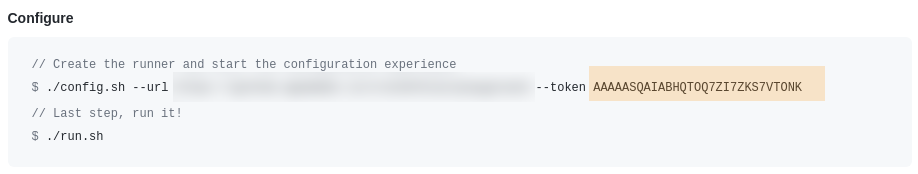
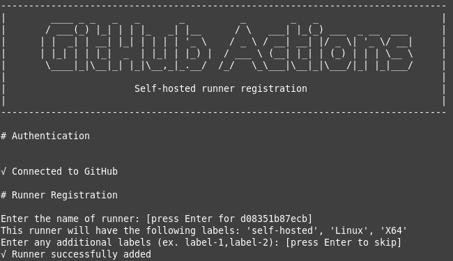

# Ubuntu based GH Action Runner

Easily add an Action Runner to your GH repo.

## How to

1. Build the image
```
docker build -t gh-actions-runner:2.272 -t gh-actions-runner:latest .
```

2. Get your token in GH
Go to your repository settings, then click on the `Actions` link




3. Start the container
```
docker run --env GHAR_REPO="https://github.com/user/repo" --env GHAR_TOKEN="TOKEN_VALUE_FROM_GH" --name gh-actions-runner gh-actions-runner:latest
```

It should show something like this

